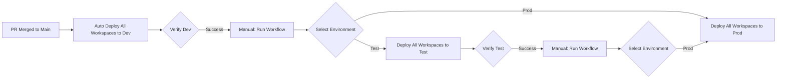

# Fabric CI/CD Reference Architecture

[](https://www.python.org/downloads/)
[](https://opensource.org/licenses/MIT)
[](https://github.com/astral-sh/ruff)

A reference architecture for implementing CI/CD pipelines for Microsoft Fabric workspaces using GitHub Actions and the `fabric-cicd` Python library. Supports deploying multiple workspaces from a single repository with automatic change detection.

## Overview

This repository demonstrates best practices for deploying Microsoft Fabric workspace items (Lakehouses, Notebooks, Pipelines, Semantic Models, etc.) across multiple workspaces and environments using Git-based version control and automated deployment pipelines.

## Quick Start

**Want to get started quickly?** Follow these steps:

1. **Fork this repository** or clone it as a template
2. **Set up Azure Service Principal** with Fabric permissions ([Setup Guide](https://github.com/dc-floriangaerner/dc-fabric-cicd/wiki/Setup-Guide))
3. **Configure GitHub Secrets**: `AZURE_CLIENT_ID`, `AZURE_CLIENT_SECRET`, `AZURE_TENANT_ID`
4. **Create or configure Fabric workspaces**: `[D] Fabric Blueprint`, `[T] Fabric Blueprint`, `[P] Fabric Blueprint`
5. **Update workspace configuration**: Edit `workspaces/Fabric Blueprint/config.yml` and `parameter.yml`
6. **Make changes** and create a Pull Request to `main`
7. **Merge PR** → Automatic deployment to Dev environment
8. **Verify** → Manually deploy to Test and Production via GitHub Actions

For detailed instructions, see the [GitHub Wiki](https://github.com/dc-floriangaerner/dc-fabric-cicd/wiki).

### Architecture

- **Multi-Workspace Support**: Deploy multiple Fabric workspaces from a single repository
- **Automatic Workspace Creation**: Auto-create workspaces if they don't exist (optional)
- **Medallion Architecture**: Bronze → Silver → Gold data layers
- **Multi-stage Deployment**: Dev → Test → Production with approval gates
- **Git-based Deployment**: Single source of truth in `main` branch
- **Dynamic Workspace Naming**: Automatic stage prefixes ([D], [T], [P])
- **ID Transformation**: Automatic adjustment of workspace-specific references

### Repository Structure

```
workspaces/
└── Fabric Blueprint/           # Single template workspace
    ├── config.yml              # Workspace names per environment
    ├── parameter.yml           # Workspace-specific configuration  
    ├── 1_Bronze/               # Raw data ingestion
    ├── 2_Silver/               # Transformed/cleansed data
    ├── 3_Gold/                 # Business-ready analytics
    └── 4_Analytics/            # Semantic models, reports, agents
```

Each subfolder in `workspaces/` represents a separate Fabric workspace with its own configuration and items. The `Fabric Blueprint` folder serves as the canonical template for creating new workspaces.

### Workspace Naming Convention

Workspace names are defined in each workspace's `config.yml` file for each environment:

| Folder | Dev Workspace | Test Workspace | Prod Workspace |
|--------|---------------|----------------|----------------|
| `Fabric Blueprint` | `[D] Fabric Blueprint` | `[T] Fabric Blueprint` | `[P] Fabric Blueprint` |

Workspace names are explicitly configured in `config.yml` per workspace folder - not auto-generated from folder names.


## Prerequisites

### Azure Setup

1. **Azure Service Principal** with permissions:
   - Microsoft Entra ID (Azure AD) authentication
   - Fabric Workspace Admin or Contributor permissions for all target workspaces

2. **Microsoft Fabric Workspaces**:
   - Create workspaces for each environment (using workspace folder names as base):
     - Dev: `[D] Fabric Blueprint`
     - Test: `[T] Fabric Blueprint`
     - Prod: `[P] Fabric Blueprint`
   - Or enable automatic workspace creation (see Optional Secrets below)

### GitHub Setup

Configure the following **GitHub Secrets** in your repository:

**Required Secrets:**
- `AZURE_CLIENT_ID` - Service Principal Client ID
- `AZURE_CLIENT_SECRET` - Service Principal Secret
- `AZURE_TENANT_ID` - Azure AD Tenant ID

**Optional Secrets (for workspace auto-creation and admin group):**
- `FABRIC_CAPACITY_ID_DEV` - Dev capacity ID (enables auto-creation)
- `FABRIC_CAPACITY_ID_TEST` - Test capacity ID (enables auto-creation)
- `FABRIC_CAPACITY_ID_PROD` - Prod capacity ID (enables auto-creation)
- `DEPLOYMENT_SP_OBJECT_ID` - Service Principal Object ID for workspace admin role
- `FABRIC_ADMIN_GROUP_ID` - Entra ID group Object ID for centralized admin access (recommended)

**About FABRIC_ADMIN_GROUP_ID:**
- Assigns an Entra ID (Azure AD) security group as admin to all deployed workspaces
- Enables centralized access management through Azure AD group membership
- All group members automatically receive Admin permissions to workspaces
- Must be stored as a GitHub Secret for security (never commit to repository)
- Optional but recommended for team-based access management

**To add secrets**: Go to repository Settings → Secrets and variables → Actions → New repository secret

### GitHub Environments

Create environments to organize deployments:
1. Go to Settings → Environments
2. Create environments: `dev`, `test`, `production`
3. Configure deployment branch rules (e.g., "Protected branches only")

> **Note**: Required reviewers require GitHub Team/Enterprise. This architecture uses manual workflow triggers for Test and Prod instead.

## Getting Started

### 1. Configure Workspace Parameter Files

Each workspace has its own `parameter.yml` file in its root directory. Edit the file for each workspace to configure ID transformations:

**Example: `workspaces/Fabric Blueprint/parameter.yml`**

```yaml
find_replace:
  # Valid optional fields: is_regex, item_type, item_name, file_path
  - find_value: "your-dev-lakehouse-bronze-id"
    replace_value:
      _ALL_: "$items.Lakehouse.lakehouse_bronze.id"
    item_type: "Notebook"
```

**How to find Item IDs**:
1. Open your Dev workspace in Fabric
2. Navigate to workspace settings or item details
3. Copy the Item ID (GUID format)

### 2. Add a New Workspace

```bash
# Create workspace folder structure
mkdir workspaces/"Your Workspace Name"

# Create parameter.yml file
cat > workspaces/"Your Workspace Name"/parameter.yml << 'EOF'
find_replace:
  - find_value: "dev-item-id"
    replace_value:
      _ALL_: "$items.Lakehouse.your_lakehouse.id"
    item_type: "Notebook"
EOF

# Add workspace items (Lakehouses, Notebooks, etc.)
mkdir -p workspaces/"Your Workspace Name"/1_Bronze
# ... add items as needed
```

### 3. Initial Setup

```bash
# Clone your repository
git clone https://github.com/<your-org>/<your-repo>.git
cd <your-repo>

# Create a feature branch
git checkout -b feature/my-feature

# Make changes to workspace items
# ... edit items in "workspaces/<workspace-name>/" directory ...

# Commit and push
git add .
git commit -m "Add new feature"
git push origin feature/my-feature
```

### 4. Deploy via Pull Request

1. Create a Pull Request to `main` branch
2. Wait for review and approval
3. Merge PR to `main`
4. **Automatic deployment to Dev** starts immediately


### 5. Promote to Test/Production

After successful Dev deployment and manual verification:

**Deploy to Test or Production:**
1. Go to **Actions** tab → **Deploy to Microsoft Fabric**
2. Click **Run workflow**
3. Select the target environment from dropdown:
   - `dev` - Development environment
   - `test` - Test environment
   - `prod` - Production environment
4. Click **Run workflow** button

## CI/CD Pipeline

### Workflow Stages



### Deployment Environments

| Environment | Trigger | Use Case |
|-------------|---------|----------|
| **Dev** | Auto on merge to `main` | Automatic deployment for rapid iteration |
| **Test** | Manual workflow dispatch | After Dev verification |
| **Production** | Manual workflow dispatch | After Test verification |

### Deployment Process

For each workspace in the deployment:

1. **Auto-Discover Workspaces** - Automatically discovers all workspace folders with `config.yml`
2. **Authenticate** - Login using Service Principal (ClientSecretCredential)
3. **Transform IDs** - Replace environment-specific IDs based on workspace `parameter.yml`
4. **Deploy Items** - Publish items using `fabric-cicd` library
5. **Clean Up Orphans** - Remove items not in repository
6. **Report Status** - Display deployment summary in GitHub Actions

### Atomic Deployment with Rollback (Planned Feature)

> **Note**: Atomic rollback is planned for future implementation. Currently, if a workspace deployment fails, the pipeline stops and reports the error, but previously deployed workspaces in that run are not automatically rolled back.

**Planned behavior**: All workspace deployments in a single workflow run will succeed together:

```
Deployment Order:
1. Workspace A → Success ✓
2. Workspace B → Success ✓
3. Workspace C → FAILURE ✗

Rollback Triggered (Planned):
1. Rollback Workspace B → Restored
2. Rollback Workspace A → Restored
3. Exit with error and failure report
```

This will ensure environments remain in a consistent state even when deployments fail.

### ID Transformation

The pipeline automatically replaces environment-specific IDs:

| Type | From (Dev) | To (Target Env) |
|------|-----------|-----------------|
| Lakehouse IDs | Dev lakehouse ID | Target env lakehouse ID |
| Workspace IDs | Dev workspace ID | Target env workspace ID |
| SQL Endpoints | Dev SQL endpoint | Target env SQL endpoint |
| Connections | Dev connection ID | Target env connection ID |


## Development Workflow

### Branch Strategy

- **main**: Protected branch, single source of truth
- **feature/\***: Short-lived feature branches
- **Private dev branches**: Individual developer isolation

### Best Practices

1. **Small, frequent commits** - Keep changes atomic
2. **Test locally** - Use private dev workspace connected to feature branch
3. **Parameterize everything** - No hardcoded IDs or environment-specific values
4. **Group related changes** - Commit changes to related workspaces together
5. **Document changes** - Clear commit messages
6. **Review before merge** - Always use Pull Requests

### Working with Fabric Items

Each Fabric item follows this structure:
```
item-name.ItemType/
├── item-type-content.json/py  # Main definition
├── item-type.metadata.json    # Metadata
└── alm.settings.json          # ALM config (lakehouses)
```

**Adding a new item to a workspace**:
1. Navigate to the workspace folder: `workspaces/<workspace-name>/`
2. Create the item directory structure
3. Add required metadata files
4. Commit changes
5. Open PR to `main`

**Adding a new workspace**:
1. Create folder in `workspaces/`: `workspaces/<New Workspace>/`
2. Create `parameter.yml` in the workspace folder
3. Add workspace items (Lakehouses, Notebooks, etc.)
4. Commit and open PR to `main`
5. Ensure corresponding Fabric workspaces exist in all environments

### Workspace-Level Configuration

Each workspace folder must contain a `parameter.yml` file with workspace-specific ID transformations:

```yaml
# workspaces/Fabric Blueprint/parameter.yml
find_replace:
  - find_value: "dev-lakehouse-id"
    replace_value:
      _ALL_: "$items.Lakehouse.lakehouse_silver.id"
    item_type: "Notebook"
    description: "Replace lakehouse references"
```

This allows each workspace to have different transformation rules independent of other workspaces.

## Troubleshooting

### Common Issues

**Deployment fails with authentication error**
- Verify GitHub secrets are correctly configured (CLIENT_ID, CLIENT_SECRET, TENANT_ID)
- Check Service Principal has Fabric workspace permissions (Admin or Contributor) for all workspaces
- Ensure Service Principal is registered in correct Azure AD tenant

**Workspace not found error**
- If automatic workspace creation is enabled: Check capacity ID secrets and Workspace Creator permission
- If manual creation: Ensure target workspace exists in Fabric with correct name
- Verify workspace name in `config.yml` matches actual workspace name (case-sensitive)
- Check Service Principal has access to the workspace

**Workspace creation fails**
- Verify `FABRIC_CAPACITY_ID_*` secrets are set in GitHub repository (Settings → Secrets)
- Check Service Principal has "Workspace Creator" permission in Fabric Admin Portal:
  - Navigate to: Tenant Settings → Developer Settings
  - Enable: "Service principals can create and edit Fabric workspaces"
  - Add your Service Principal to the allowed list
- Verify capacity ID is valid and capacity is not paused
- Check `DEPLOYMENT_SP_OBJECT_ID` contains the Object ID (not Client ID):
  - Azure Portal → Azure Active Directory → Enterprise Applications
  - Search by Client ID → Copy Object ID field

**Permission errors during deployment**
- Check Service Principal has necessary Fabric API permissions
- Verify Service Principal has Admin or Contributor role in target workspaces
- For auto-creation: Ensure "Workspace Creator" tenant setting is enabled
- Review Service Principal permissions in Azure AD and Fabric Admin Portal

**ID transformation not working**
- Ensure workspace `parameter.yml` has correct Dev workspace IDs
- Verify item names match exactly (case-sensitive)
- Check regex patterns are valid if using `is_regex: "true"`

**Orphan items not removed**
- Check workspace `parameter.yml` doesn't have `skip_orphan_cleanup: true`
- Verify item is in scope for deployment

**Deployment not triggered**
- Automatic Dev deployments only trigger on changes in `workspaces/**` paths
- Changes to `.github/`, `scripts/`, `README.md` etc. will NOT trigger automatic deployment
- Use manual workflow dispatch to deploy without workspace changes

### Viewing Logs

1. Go to **Actions** tab in GitHub
2. Select the workflow run
3. Click on job name (e.g., "Deploy to Dev")
4. Expand steps to view detailed logs
5. Look for workspace-specific deployment sections

### Debug Mode

Enable debug logs by setting GitHub secret:
- `ACTIONS_RUNNER_DEBUG` = `true`

## Configuration Reference

### Workspace parameter.yml Structure

Each workspace folder contains its own `parameter.yml` file:

```yaml
# workspaces/<workspace-name>/parameter.yml
find_replace:
  - find_value: "string-to-find"      # Dev environment value
    replace_value:
      _ALL_: "replacement-value"      # Target environment value
    item_type: "Notebook"              # Item type to apply to
    is_regex: "false"                  # Use regex matching
    description: "What this replaces"  # Documentation
```

### Supported Item Types

- `Lakehouse` - Data storage
- `Notebook` - PySpark/Python notebooks
- `DataPipeline` - Copy jobs and pipelines
- `SemanticModel` - Power BI semantic models
- `Environment` - Spark compute environments
- `DataAgent` - AI agent definitions

## Documentation

### GitHub Wiki

Comprehensive documentation is maintained in the [GitHub Wiki](https://github.com/dc-floriangaerner/fabric-cicd/wiki):

- **[Home](https://github.com/dc-floriangaerner/fabric-cicd/wiki/Home)** - Wiki overview and quick links
- **[Setup Guide](https://github.com/dc-floriangaerner/fabric-cicd/wiki/Setup-Guide)** - Step-by-step setup instructions
- **[Workspace Configuration](https://github.com/dc-floriangaerner/fabric-cicd/wiki/Workspace-Configuration)** - Configure workspaces with config.yml and parameter.yml
- **[Deployment Workflow](https://github.com/dc-floriangaerner/fabric-cicd/wiki/Deployment-Workflow)** - Understand the CI/CD pipeline
- **[Troubleshooting](https://github.com/dc-floriangaerner/fabric-cicd/wiki/Troubleshooting)** - Common issues and solutions

### Editing Wiki Documentation

Wiki documentation is maintained in the `/wiki` folder in this repository. When you make changes to markdown files in `/wiki` and merge to `main`, they are automatically synced to the GitHub Wiki via a GitHub Actions workflow.

**Workflow:**
1. Edit markdown files in the `/wiki` folder
2. Commit changes to a feature branch
3. Create a Pull Request to `main`
4. After merge, the wiki is automatically updated

This approach allows you to:
- Version control documentation alongside code
- Review documentation changes in Pull Requests
- Keep documentation and code in sync

## Contributing

We welcome contributions! Please see [CONTRIBUTING.md](CONTRIBUTING.md) for detailed guidelines on:
- Reporting bugs and requesting features
- Development workflow and branch strategy
- Coding standards and testing requirements
- Pull Request process

## License

This project is licensed under the MIT License - see the [LICENSE](LICENSE) file for details.

## Resources

- [Microsoft Fabric Documentation](https://learn.microsoft.com/fabric/)
- [fabric-cicd Library](https://pypi.org/project/fabric-cicd/)
- [GitHub Actions Documentation](https://docs.github.com/actions)
- [Azure Service Principal Setup](https://learn.microsoft.com/azure/active-directory/develop/howto-create-service-principal-portal)
